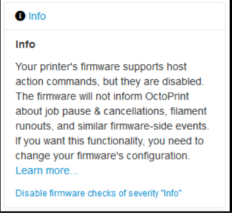

# Amending Marlin configuration

## Overview

My first 3d printer was a Creality Ender-3 V3 SE, and from the very start I was using it with a Raspberry Pi 3 and OctoPrint.
Annoyingly, there was always a notification being displayed, as shown below, which I could safely ignore.

Until, I purchased a Creality Runout sensor, this worked perfectly out the box if you were using the SD card to start your prints.
After a bit of digging, I found that I needed to enable a couple of features (HOST_ACTION_COMMAND and FILAMENT_RUNOUT_SENSOR).
I initially came across the TomasekJ Ender-3V3-SE github repository, and was unable to enable these features (I tried downloading the source zip file and cloning the repo).
I downloaded and installed the SE_Firmware_107.bin, which worked fine, minus the runout sensor opiton. And for the life of me, I couldn't get it to enable; and it wasn't for the lack of trying!
I noticed a comment by rtorchia, asking about the same setting, and proceeded to clone his fork.
After cloning this new repo, I amended the settings, and it worked as it should!

Just an FYI, my daily driver is a Linux laptop running Pop OS 22.04 LTS, I spent so much time trying to compile the firmware using VSCode on this platform, and I couldn't get it to compile successfully.

Please see the 1.0.7 from TomasekJ repo and a 1.0.8 bin, which I compiled from rtorchia's repo.

# References

- https://octoprint.org/
- https://plugins.octoprint.org/plugins/eeprom_marlin/
- https://github.com/TomasekJ/Ender-3V3-SE/releases/tag/V1.0.7
- https://github.com/rtorchia/Ender-3V3-SE/tree/main

