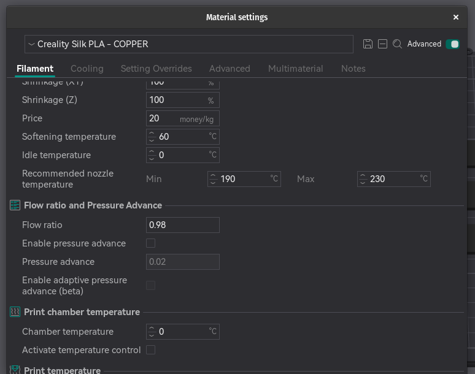

# Fine Tuning filament settings - Flow Ratio

- Open a **_New Project_** in OrcaSlicer.
- Select **_Calibration_** Flow Rate, PASS 1.
- Ensure the correct printer and Filament are select.
- Slice the plate and send to the printer.
- Examine the tiles and select the best one i.e. no under/over extrusion.

In this example tile 5 was the best tile, this will be +5, this is then applied to the following formula.

<CURRENT_FLOW_RATIO>x(100<-/+TILE_NUMBER>/100 = <PASS_1_RESULT>

The <CURRENT_FLOW_RATIO> can be found in the **_Material settings_** of the filament.

In this example it is **_0.98_** so the formula will be as follows.

0.98x(100+5)/100  
0.98x105/100  
102.9/100=1.029

NOTE: If the best tile was -5, then the equation would have been 0.98x(100-5)/100.

This give us our **_PASS 1_** result, enter this as the new value into the **_Flow Ratio_** and save the setting.

- Open a **_New Project_** in OrcaSlicer.
- Select **_Calibration_** Flow Rate, PASS 2.
- Ensure the correct printer and Filament are select.
- Slice the plate and send to the printer.
- Examine the tiles and select the best one i.e. no under/over extrusion.
- Applying the formula to obtain the new Flow Ratio

1.029x(100-5)/100=<PASS_2_RESULT>

Enter the new result into the **_Flow Ratio_** setting, and save the settings.

# Reference

- https://github.com/SoftFever/OrcaSlicer/wiki/Calibration
- https://www.youtube.com/watch?v=caMCAk57SJY&list=PLTUKz_jdjiEHsJzwNTSKkbjuGbwPEg-22&index=5
