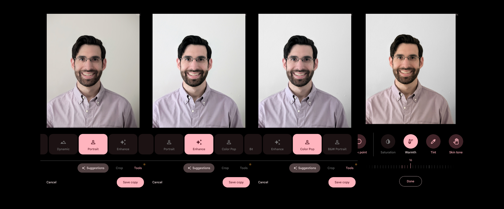

# Create your own photo for ID picture

[https://blog.google/products/pixel/take-id-photo-google-pixel-tips/](https://blog.google/products/pixel/take-id-photo-google-pixel-tips/)

Just started a new job and need a photo for your work profile? Want a nice-looking photo for your ID badge that you’ll be happy to look at every day? For both instances, you'll need a slick, professional-looking portrait. The secret to getting one that's just right — without a pro photographer or fancy DSLR — might be right in your pocket: Just pull out your Pixel.

To help you get the perfect photo, I chatted with Michael Specht, a [pro photographer](https://www.michael-specht.com/) and product manager on the Pixel camera team, for tips on great framing and helpful features. Then I used my Pixel 6 Pro and [Pixel Fold](https://store.google.com/product/pixel_fold?utm_source=keyword&utm_medium=google_oo&utm_campaign=GS107607&utm_content=blog&hl=en-US) to take his recommendations for a spin and shoot a brand-new headshot of my own. Here are his tips, plus how I put them into practice.

A photo captured with a Pixel 6 Pro (left) versus with a professional-grade setup featuring dedicated camera equipment (right).

## **1. Choose a fitting outfit and expression**

For the best possible photo, avoid wearing bulky accessories like sunglasses or headphones, and put on a smile or natural expression. (In other words: Frowning, squinting or raised eyebrows are probably not the right fit.)

How not to take a great ID photo (left). You’ll want a plain background and a natural expression (right).

“Wear something that reflects you,” Michael recommends. “And from a photography perspective, it’s great to have some contrast between you and the background you’ll be shooting against. Consider wearing clothing that differs from the background color to create separation.”

A light shirt can blend into a white background, whereas a darker shirt will help you stand out.

## **2. Find the right spot with natural light**

Next, you’ll need to do a little location scouting. “Find a background that is simple and doesn’t distract from you, the subject,” says Michael. Remember: With a portrait photo like this, you’re the star of the show, not whatever’s behind you. “For simplicity’s sake, I suggest a solid color background. Traditionally this could be white or off-white, but eye-catching, bright colors can work well, too,” says Michael.

Once you’ve found a background you like, make sure the lighting’s good. “The ideal location for headshots is near a window with plenty of natural light or outside just inside some shade,” says Michael. “Make sure that the light isn’t shining directly on your face. You’re looking for somewhere brightly lit, but with indirect natural light.” [Real Tone](https://blog.google/products/search/monk-skin-tone-scale/) on Pixel will also help here — it’ll automatically adjust white balance and brightness to accurately capture a diverse range of skin tones.

Plus, pay attention to the time when taking your photos. “The best time of day to capture will depend on your specific location. “Scout the location throughout the day to determine what time has plenty of great indirect light,” Michael recommends. “That way, the light will reflect off the ground or another surface and bounce towards your face, creating this nice diffused lighting effect — and that’s the key to a good photo.”

Make sure you have even lighting that doesn’t wash you out or leave parts of your face in shadow.

## **3. Have someone else take your photo…**

“If possible, you’ll want to find a volunteer to actually help you take the photo,” says Michael. “Pixel’s front and rear-facing cameras are both incredibly capable, but to get the best quality possible for your headshot, use the rear camera on your Pixel.” That’s because Pixel’s rear cameras feature larger sensors that let in more light and can take higher resolution pictures — ensuring that your final shot is as crisp and clear as possible.

That means you’ll probably want to call in a friend or family to help you take the photo. (Don’t forget to return the favor and help them with their own headshot if they want one!)

## **4. …or take a selfie**

If you need to take your portrait solo, don’t worry. You can prop up your camera with a stack of books — or even better, use [Pixel Fold’s tabletop mode](https://blog.google/products/pixel/pixel-fold-review/) — and use the self-timer on your Pixel to give you a chance to get into frame. The [Palm Timer](https://blog.google/products/pixel/feature-drop-june-2023/) feature, where you can trigger the timer once you're ready by raising your hand, works great here, too. And you can use the Google Camera app on your Pixel Watch as a remote shutter, too.

Alternatively, you can try the selfie camera. While not quite as powerful as the primary camera, it should still get you some pretty great results in a pinch. “If you are taking the photo handheld yourself, you’ll want to be careful of your arm placement to make sure that it doesn’t take up a big part of the frame,” says Michael.

Your Pixel’s selfie camera can also help take a good portrait photo. Just remember: You’re posing for an ID photo, not a moody social media selfie.

## **5. Frame the shot perfectly**

For a headshot, the framing is key. Aim for your face to take up about ⅓ of the photo height, and the top of your body another third. Fortunately, Pixel makes it easy to line up the perfect shot: Simply open up the Camera app, hit the Settings button in the bottom left corner, tap “More settings” and scroll down to the Composition section to select a 3 x 3 grid type.

Caption: Turning on the grid will help you frame your shot perfectly.

## **6. Choose the best camera mode**

“For headshots, my recommendation is generally Photo mode over your Pixel's Portrait mode,” says Michael. “Since you’ll likely be shooting against a solid backdrop, you’re not trying to intentionally create [bokeh](https://en.wikipedia.org/wiki/Bokeh) in this case.”

Typically, you’ll want to use the main camera lens on most Pixel phones. But for more advanced Pixel devices, like the Pixel 6 Pro (the 4x setting on your app), Pixel 7 Pro (the 5x lens setting), or Pixel Fold (also 5x), you can also try using the telephoto zoom lens.

“If you have a telephoto lens on your Pixel — and enough space to still frame yourself nicely from farther away — you can use it to get a shot with a more traditional focal length for a portrait image and to create less foreshortening of your face,” Michael says.

The main camera lens on a Pixel Fold (left) compared to a shot using the 5x telephoto lens (right).

## **7. Shoot your shot**

With that, you’re all set to snap your photo.

“What I like to do is get set up with a volunteer photographer and a location, place myself where I can get the best light against a solid color wall, take a couple test shots, and have a quick look at them to make any adjustments I need,” says Michael.

Try to take a few different shots, experiment with smiling or the differences between the main and telephoto lenses, and make sure that you have one that you’re happy with!

Don’t be afraid to take lots (and lots) of different versions.

If you’re satisfied with your new ID photo at this point, you’re good to go.

## **8. Edit your pictures if needed**

If you want to take things even further, you can hop into the Google Photos app for some editing. More advanced editors can dive right in and adjust specific aspects like brightness, contrast, and HDR. But if you’re newer to photography, a good place to start is with Pixel’s suggested edits, which can automatically spruce up your images for you in a variety of styles.

Try using Pixel’s suggested edits — or dive in and mess around with some settings on your own — to get a look and style you love.

With Google Photos, edits are easier than ever. So even if you’re not an experienced photographer, try tweaking some settings and just see what they do and if you like the overall effect. Since Photo’s edits leave your original image untouched, you can always go back to what you started with. “The key is experimenting,” says Michael. “How do *you* want to show yourself to the world?”
